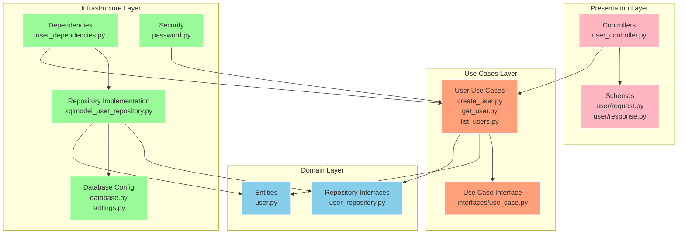

# Projeto FastAPI com Clean Architecture

Uma aplicação web moderna construída com FastAPI, SQLModel e princípios de Clean Architecture.

## Visão Geral da Arquitetura

Este projeto segue os princípios da Clean Architecture para manter a separação de responsabilidades e garantir testabilidade e manutenibilidade.

```
┌─────────────────────────────────────────────────────────┐
│                     Camada de Apresentação              │
│                                                         │
│  ┌─────────────────┐          ┌───────────────────┐     │
│  │   Controllers   │          │      Schemas      │     │
│  └─────────────────┘          └───────────────────┘     │
└───────────────────────────────────────────────────┬─────┘
                                                    │
                                                    ▼
┌─────────────────────────────────────────────────────────┐
│                     Camada de Use Cases                 │
│                                                         │
│  ┌─────────────────┐    ┌──────────────────────┐        │
│  │   Casos de Uso  │    │  Interface de Casos  │        │
│  └─────────────────┘    │        de Uso        │        │
│                         └──────────────────────┘        │
└───────────────────────────────────────────────────┬─────┘
                                                    │
                                                    ▼
┌─────────────────────────────────────────────────────────┐
│                     Camada de Domínio                   │
│                                                         │
│  ┌─────────────────┐    ┌───────────────┐               │
│  │    Entidades    │    │ Interfaces de │               │
│  └─────────────────┘    │  Repositório  │               │
│                         └───────────────┘               │
│                                                         │
└──────────────────────────────┬──────────────────────────┘
                               │
                               ▼
┌─────────────────────────────────────────────────────────┐
│                  Camada de Infraestrutura               │
│                                                         │
│  ┌─────────────────┐    ┌───────────────────────┐       │
│  │  Configuração   │    │   Implementações de   │       │
│  │   do Banco      │    │      Repositório      │       │
│  └─────────────────┘    └───────────────────────┘       │
│                                                         │
│  ┌─────────────────────────────────────────────┐        │
│  │               Dependências                  │        │
│  └─────────────────────────────────────────────┘        │
└─────────────────────────────────────────────────────────┘
```

## Características

- Padrão de design Clean Architecture
- FastAPI para desenvolvimento de API de alto desempenho
- SQLModel para operações de banco de dados com segurança de tipos
- Docker e Docker Compose para fácil implantação
- Poetry para gerenciamento de dependências
- Banco de dados PostgreSQL

## Primeiros Passos

### Pré-requisitos

- Python 3.13+
- Docker e Docker Compose
- Poetry

### Instalação

1. Clone o repositório:

```bash
git clone https://github.com/walber-vaz/learn_clean_arch_fastapi.git
cd learn_clean_arch_fastapi
```

2. Instale as dependências:

```bash
poetry install
```

3. Inicie o ambiente de desenvolvimento:

```bash
docker-compose up -d
```

4. Execute a aplicação:

```bash
poetry run uvicorn src.app.main:app --reload
```

5. Acesse a documentação da API:

```
http://localhost:8000/docs
```

## Estrutura do Projeto

```
.
├── alembic.ini
├── compose.yml
├── Dockerfile
├── .editorconfig
├── .gitignore
├── LICENSE
├── poetry.lock
├── .pre-commit-config.yaml
├── pyproject.toml
├── .python-version
├── README.md
├── requirements-dev.txt
├── requirements.txt
├── migrations
│   ├── env.py
│   ├── README
│   ├── script.py.mako
│   └── versions
│       └── b4d2e3210ead_init.py
├── postgres
│   ├── create-databases.sh
│   └── Dockerfile
├── src
│   └── app
│       ├── constants.py
│       ├── main.py
│       ├── domain
│       │   ├── entities
│       │   │   └── user.py
│       │   ├── repositories
│       │   │   └── user_repository.py
│       │   └── use_cases
│       │       ├── interfaces
│       │       │   └── use_case.py
│       │       └── user
│       │           ├── create_user.py
│       │           ├── get_user.py
│       │           └── list_users.py
│       ├── infrastructure
│       │   ├── config
│       │   │   ├── database.py
│       │   │   └── settings.py
│       │   ├── dependencies
│       │   │   └── user_dependencies.py
│       │   ├── repositories
│       │   │   └── sqlmodel_user_repository.py
│       │   └── security
│       │       └── password.py
│       └── presentation
│           ├── controllers
│           │   └── user_controller.py
│           └── schemas
│               ├── common
│               │   └── pagination.py
│               └── user
│                   ├── request.py
│                   └── response.py
└── tests

```

## Camadas da Clean Architecture

### Camada de Domínio

O núcleo da aplicação, contendo:

- **Entidades**: Objetos de negócio
- **Interfaces de Repositório**: Interfaces abstratas para acesso a dados
- **Casos de Uso**: Regras de negócio específicas da aplicação

### Camada de Infraestrutura

Lida com preocupações externas:

- **Implementações de Repositório**: Implementações concretas das interfaces de repositório
- **Configuração de Banco de Dados**: Configuração de conexão e gerenciamento de sessão
- **Dependências**: Injeção de dependências para casos de uso e repositórios

### Camada de Apresentação

Lida com requisições e respostas HTTP:

- **Controllers**: Endpoints de API
- **Schemas**: Modelos de dados para Requisição/Resposta

## Desenvolvimento

### Adicionando uma Nova Entidade

1. Crie a entidade em `domain/entities/`
2. Defina a interface do repositório em `domain/repositories/`
3. Implemente os casos de uso em `domain/use_cases/`
4. Adicione a implementação do repositório em `infrastructure/repositories/`
5. Adicione as dependências em `infrastructure/dependencies/`
6. Crie os schemas em `presentation/schemas/`
7. Adicione o controller em `presentation/controllers/`

### Executando Testes

```bash
poetry run pytest
```

## Implantação

A aplicação está containerizada para fácil implantação:

```bash
# Construir e iniciar containers
docker-compose up --build

# Executar em modo desanexado
docker-compose up -d
```

## Gráfico



## Licença

Distribuído sob a licença BSD-3. Veja `LICENSE` para mais informações.
