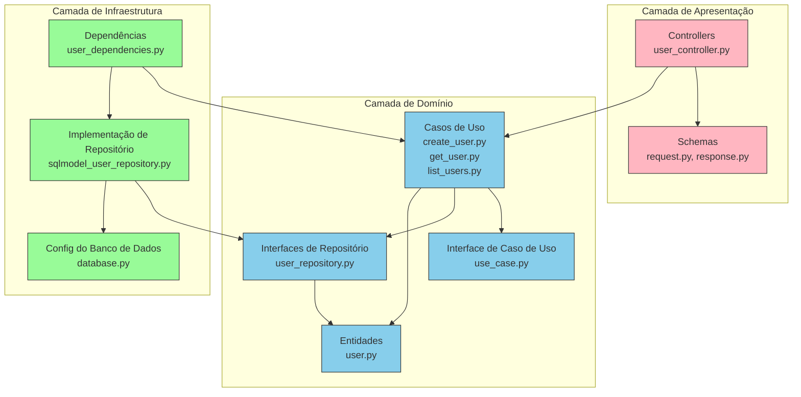

# Projeto FastAPI com Clean Architecture

Uma aplicação web moderna construída com FastAPI, SQLModel e princípios de Clean Architecture.

## Visão Geral da Arquitetura

Este projeto segue os princípios da Clean Architecture para manter a separação de responsabilidades e garantir testabilidade e manutenibilidade.

```
┌─────────────────────────────────────────────────────────┐
│                     Camada de Apresentação              │
│                                                         │
│  ┌─────────────────┐          ┌───────────────────┐     │
│  │   Controllers   │          │      Schemas      │     │
│  └─────────────────┘          └───────────────────┘     │
└───────────────────────────────────────────────────┬─────┘
                                                    │
                                                    ▼
┌─────────────────────────────────────────────────────────┐
│                     Camada de Domínio                   │
│                                                         │
│  ┌─────────────────┐    ┌───────────────┐               │
│  │    Entidades    │    │ Interfaces de │               │
│  └─────────────────┘    │  Repositório  │               │
│                         └───────────────┘               │
│  ┌─────────────────────────────────────────────┐        │
│  │                Casos de Uso                 │        │
│  └─────────────────────────────────────────────┘        │
└──────────────────────────────┬──────────────────────────┘
                               │
                               ▼
┌─────────────────────────────────────────────────────────┐
│                  Camada de Infraestrutura               │
│                                                         │
│  ┌─────────────────┐    ┌───────────────────────┐       │
│  │  Configuração   │    │   Implementações de   │       │
│  │   do Banco      │    │      Repositório      │       │
│  └─────────────────┘    └───────────────────────┘       │
│                                                         │
│  ┌─────────────────────────────────────────────┐        │
│  │               Dependências                  │        │
│  └─────────────────────────────────────────────┘        │
└─────────────────────────────────────────────────────────┘
```

## Características

- Padrão de design Clean Architecture
- FastAPI para desenvolvimento de API de alto desempenho
- SQLModel para operações de banco de dados com segurança de tipos
- Docker e Docker Compose para fácil implantação
- Poetry para gerenciamento de dependências
- Banco de dados PostgreSQL

## Primeiros Passos

### Pré-requisitos

- Python 3.13+
- Docker e Docker Compose
- Poetry

### Instalação

1. Clone o repositório:

```bash
git clone <url-do-repositório>
cd <diretório-do-projeto>
```

2. Instale as dependências:

```bash
poetry install
```

3. Inicie o ambiente de desenvolvimento:

```bash
docker-compose up -d
```

4. Execute a aplicação:

```bash
poetry run uvicorn src.app.main:app --reload
```

5. Acesse a documentação da API:

```
http://localhost:8000/docs
```

## Estrutura do Projeto

```
.
├── compose.yml            # Configuração do Docker Compose
├── Dockerfile             # Configuração do container Docker
├── poetry.lock            # Arquivo de lock do Poetry
├── pyproject.toml         # Dependências e configuração do Poetry
├── postgres/              # Configuração Docker do PostgreSQL
└── src/
    └── app/
        ├── main.py        # Ponto de entrada da aplicação
        ├── domain/        # Lógica de negócio e regras
        │   ├── entities/  # Objetos de negócio
        │   ├── repositories/ # Interfaces abstratas de repositório
        │   └── use_cases/ # Casos de uso de negócio
        ├── infrastructure/ # Interfaces externas
        │   ├── config/    # Configuração (banco de dados, etc.)
        │   ├── dependencies/ # Injeção de dependências
        │   └── repositories/ # Implementações de repositório
        └── presentation/  # Camada de API
            ├── controllers/ # Endpoints de API
            └── schemas/   # Modelos de Requisição/Resposta
```

## Camadas da Clean Architecture

### Camada de Domínio

O núcleo da aplicação, contendo:

- **Entidades**: Objetos de negócio
- **Interfaces de Repositório**: Interfaces abstratas para acesso a dados
- **Casos de Uso**: Regras de negócio específicas da aplicação

### Camada de Infraestrutura

Lida com preocupações externas:

- **Implementações de Repositório**: Implementações concretas das interfaces de repositório
- **Configuração de Banco de Dados**: Configuração de conexão e gerenciamento de sessão
- **Dependências**: Injeção de dependências para casos de uso e repositórios

### Camada de Apresentação

Lida com requisições e respostas HTTP:

- **Controllers**: Endpoints de API
- **Schemas**: Modelos de dados para Requisição/Resposta

## Desenvolvimento

### Adicionando uma Nova Entidade

1. Crie a entidade em `domain/entities/`
2. Defina a interface do repositório em `domain/repositories/`
3. Implemente os casos de uso em `domain/use_cases/`
4. Adicione a implementação do repositório em `infrastructure/repositories/`
5. Adicione as dependências em `infrastructure/dependencies/`
6. Crie os schemas em `presentation/schemas/`
7. Adicione o controller em `presentation/controllers/`

### Executando Testes

```bash
poetry run pytest
```

## Implantação

A aplicação está containerizada para fácil implantação:

```bash
# Construir e iniciar containers
docker-compose up --build

# Executar em modo desanexado
docker-compose up -d
```

## Gráfico


