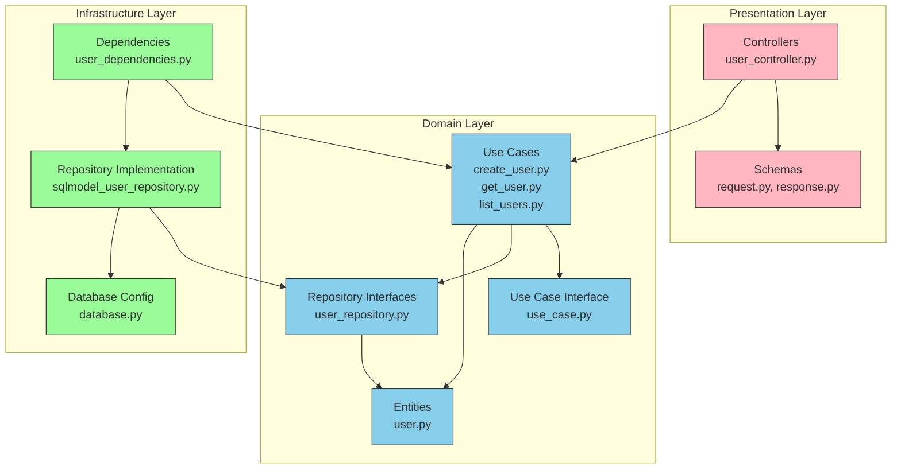

# FastAPI Clean Architecture Project

A modern web application built with FastAPI, SQLModel, and Clean Architecture principles.

## Architecture Overview

This project follows Clean Architecture principles to maintain separation of concerns and ensure testability and maintainability.

```
┌─────────────────────────────────────────────────────────┐
│                     Presentation Layer                  │
│                                                         │
│  ┌─────────────────┐          ┌───────────────────┐     │
│  │   Controllers   │          │      Schemas      │     │
│  └─────────────────┘          └───────────────────┘     │
└───────────────────────────────────────────────────┬─────┘
                                                    │
                                                    ▼
┌─────────────────────────────────────────────────────────┐
│                      Domain Layer                       │
│                                                         │
│  ┌─────────────────┐    ┌───────────────┐               │
│  │     Entities    │    │  Repositories │               │
│  └─────────────────┘    │   Interfaces  │               │
│                         └───────────────┘               │
│  ┌─────────────────────────────────────────────┐        │
│  │                 Use Cases                   │        │
│  └─────────────────────────────────────────────┘        │
└──────────────────────────────┬──────────────────────────┘
                               │
                               ▼
┌─────────────────────────────────────────────────────────┐
│                   Infrastructure Layer                  │
│                                                         │
│  ┌─────────────────┐    ┌───────────────────────┐       │
│  │   Database      │    │ Repository            │       │
│  │  Configuration  │    │ Implementations       │       │
│  └─────────────────┘    └───────────────────────┘       │
│                                                         │
│  ┌─────────────────────────────────────────────┐        │
│  │              Dependencies                   │        │
│  └─────────────────────────────────────────────┘        │
└─────────────────────────────────────────────────────────┘
```

## Features

- Clean Architecture design pattern
- FastAPI for high-performance API development
- SQLModel for type-safe database operations
- Docker & Docker Compose for easy deployment
- Poetry for dependency management
- PostgreSQL database

## Getting Started

### Prerequisites

- Python 3.10+
- Docker and Docker Compose
- Poetry

### Installation

1. Clone the repository:

```bash
git clone <repository-url>
cd <project-directory>
```

2. Install dependencies:

```bash
poetry install
```

3. Start the development environment:

```bash
docker-compose up -d
```

4. Run the application:

```bash
poetry run uvicorn src.app.main:app --reload
```

5. Visit the API documentation:

```
http://localhost:8000/docs
```

## Project Structure

```
.
├── compose.yml            # Docker Compose configuration
├── Dockerfile             # Docker container configuration
├── poetry.lock            # Poetry lock file
├── pyproject.toml         # Poetry dependencies and config
├── postgres/              # PostgreSQL Docker configuration
└── src/
    └── app/
        ├── main.py        # Application entry point
        ├── domain/        # Business logic and rules
        │   ├── entities/  # Business objects
        │   ├── repositories/ # Abstract repository interfaces
        │   └── use_cases/ # Business use cases
        ├── infrastructure/ # External interfaces
        │   ├── config/    # Configuration (database, etc.)
        │   ├── dependencies/ # Dependency injection
        │   └── repositories/ # Repository implementations
        └── presentation/  # API layer
            ├── controllers/ # API endpoints
            └── schemas/   # Request/Response models
```

## Clean Architecture Layers

### Domain Layer

The core of the application, containing:

- **Entities**: Business objects
- **Repository Interfaces**: Abstract interfaces for data access
- **Use Cases**: Application-specific business rules

### Infrastructure Layer

Handles external concerns:

- **Repository Implementations**: Concrete implementations of repository interfaces
- **Database Configuration**: Connection setup and session management
- **Dependencies**: Dependency injection for use cases and repositories

### Presentation Layer

Handles HTTP requests and responses:

- **Controllers**: API endpoints
- **Schemas**: Request/Response data models

## Development

### Adding a New Entity

1. Create entity in `domain/entities/`
2. Define repository interface in `domain/repositories/`
3. Implement use cases in `domain/use_cases/`
4. Add repository implementation in `infrastructure/repositories/`
5. Add dependencies in `infrastructure/dependencies/`
6. Create schemas in `presentation/schemas/`
7. Add controller in `presentation/controllers/`

### Running Tests

```bash
poetry run pytest
```

## Deployment

The application is containerized for easy deployment:

```bash
# Build and start containers
docker-compose up --build

# Run in detached mode
docker-compose up -d
```

## Graph


